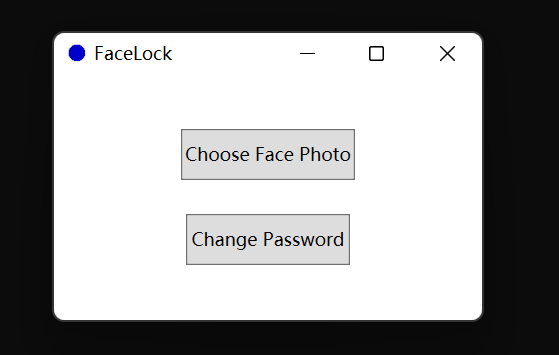
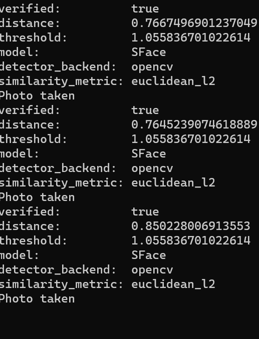

## FaceLock

Lock your computer by invoking [face verification](https://github.com/serengil/deepface)

> prerequisite: python
>
> ```shell
	pip3 install deepface
	```

### Usage

1. Choose your photo
   
   
2. Set your password, original is 123456

3. If inconsistent face was detected three times, you need enter your password in 5 seconds

####  This project use calculated by [deepface](https://github.com/serengil/deepface),  using SFace and euclidean_l2

####  
